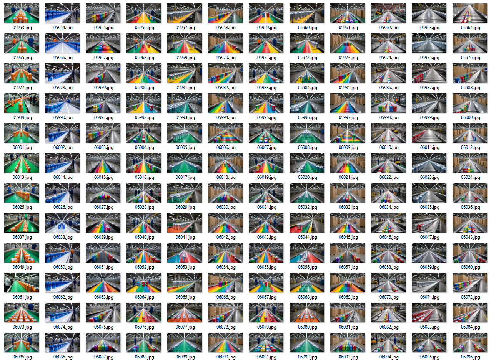

# Creating object detection model for edge AI using synthetic training images created with NVIDIA Cosmos-Predict2

[](https://youtu.be/IRxAY49st1E)

## Preface
NVIDIA has released a family of World Foundation Models (WFMs). All models have to some degree overlapping areas of use and can be combined for an efficient pipeline. This article is about **Cosmos Predict**, **Cosmos Transfer** and **Cosmos Reason** are covered in separate articles.

- [**Cosmos Transfer**](https://github.com/nvidia-cosmos/cosmos-transfer1) can amplify text and video input to create variations of environment and lighting conditions for training data for visual AI. Multiple input signals enable control of physics-aware world generation. We can compose a 3D scene in NVIDIA Omniverse and have Cosmos Transfer create the variation needed to train robust models for visual computing.
- [**Cosmos Reason**](https://github.com/nvidia-cosmos/cosmos-reason1) is capable of reasoning based on spatial and temporal understanding of multimodal input. It can interpret what a sensor is seeing and predict consequences. It can also be a helpful tool to automatically evaluate the quality of synthetic training data.
- [**Cosmos Predict**](https://github.com/nvidia-cosmos/cosmos-predict2) can create training data, both single image and video clip, for visual AI based on text- and image input.

All models are pre-trained for autonomous vehicle and robotic scenarios, and support post-training for specific use cases.

Video tutorial:

[](https://youtu.be/mJUKTgjDUEY)

## Prerequisites
- Python
- Optional: Access to NVIDIA GPU with at least 32 GB VRAM
- Optional: NVIDIA Omniverse Isaac Sim

## What to expect
This tutorial shows how to use [**NVIDIA Cosmos-predict2**](https://github.com/nvidia-cosmos/cosmos-predict2), released June 2025 to generate physics aware synthetic images for training models for visual computing. The tutorial will show hands-on approaches on how to generate text- and image-prompted images and videos, automatically segment and label objects of interest and prepare data for model training in [Edge Impulse Studio](https://edgeimpulse.com/).

We'll start with a comparison of other methods and models, walk through an easy to perform web-based demo, dive into self-hosting the smaller models, use local AI-labeling models, take full advantage of single-image generation with batching and prompt enrichment with LLMs, before we move to the larger models and video generation.

[](https://youtu.be/hyG2tCUQsDA)

In case of problems reproducing these walk-throughs, [ComfyUI now supports Cosmos Predict2](https://docs.comfy.org/tutorials/image/cosmos/cosmos-predict2-t2i).

## Alternative methods
The traditional method to create training data for visual computing is to manually capture images in the field and to label all objects of interest. As this can be a massive undertaking and it can be challenging to cover special circumstances, [synthetic training data generation](https://docs.edgeimpulse.com/experts/readme/featured-machine-learning-projects/surgery-inventory-synthetic-data) has become a popular supplement. Even with real-time path-tracing and domain randomization methods capable of generating highly controlled masses of data, covering sufficient variation to create robust models can be labor intensive.

### Generating Synthetic Images with GPT-4 (DALL-E)
")
Realistic training images can effortlessly be [generated using diffusion models such as GPT-4 Image/DALL-E](https://docs.edgeimpulse.com/docs/edge-impulse-studio/data-acquisition/synthetic-data#generating-synthetic-images-with-gpt-4-dall-e).
These images need to be labelled manually or by one of the many [AI assisted labelling methods](https://docs.edgeimpulse.com/docs/edge-impulse-studio/data-acquisition/ai-labeling), e.g. OWL-ViT.

> Note about AI labeling
> 
> Models used for labeling are trained on vast collections of manually labeled objects. They usually work great for common objects. For labeling uncommon objects, or even objects that are new, e.g. brand-new commercial products, these models fall short. In these cases **Cosmos Transfer** offer a novel architecture as label data from a 3D scene can be reused. This is due to the highly controllable nature of **Cosmos Transfer**, where certain aspects of the input signal data will be respected when a new variation of a Omniverse-created video sequence is generated. This can be achieved in a number of ways thanks to multimodal control signal input. In short - a new video clip is generated, for instance with a different background, but objects of interest stay at the same screen-space position as in the input clip. Bounding boxes therefore remain valid for both clips. **Cosmos Transfer** is not covered in this article, but this should be an important feature to consider when choosing among the different Cosmos models.

Another variation is to use video generation, such as **OpenAI Sora**, **Google Gemini Veo 3** or [any high performing video generators](https://huggingface.co/spaces/Vchitect/VBench_Leaderboard). Text, image and video input can prompt generation of video sequences. The advantage of generating video clips over still images is that we get the objects of interest in many different angles with minimal effort. For object detection, these sequences can then be split into individual still frames, before labelling.

Training image generation with these types of models have the disadvantages of being hard to control. Objects of interest will tend to morph out of form and strict camera control is hard to achieve. Generating training images of novel objects, say a new commercial product, is also currently hard to accomplish. These models have been trained for generalization, from movie stars eating pasta to presidents promoting unconventional vacation resorts.

Some comparisons:

```
The video is a first-person perspective from the viewpoint of a robot navigating through a factory or industrial setting. The robot is equipped with a camera mounted on its head, providing a view of the surroundings. The environment is a spacious, well-lit industrial area with high ceilings and large windows, allowing natural light to flood the space. The floor is made of a smooth, reflective material, possibly concrete or polished metal, which enhances the robot's movement and reflections.
```

Sora:

[](https://youtu.be/NK6jpjv-des)

Sora:

[](https://youtu.be/UAFlf6SF-_Q)

Cosmos Predict:

[](https://youtu.be/hWOfi2IGxbg)


The Sora videos are of great fidelity, but notice how Cosmos Predict defaults to a setting suitable for edge AI scenarios. We could achieve the same results with Sora, but it would require a lot of trial and error with targeted prompting. Without API access to Sora, ability to change seed or negative prompt, methodically generating 10.000s of variations for model training is impractical.

The NVIDIA Cosmos WFMs on the other hand are trained on a curated set of driving and robotics data. The ability to supply multimodal control data and to post-train the models for custom scenarios makes them further suitable for tailored training data generation. However, don't expect perfect results each time, especially with Cosmos Predict Video2World. Depending on the complexity of the scene some misses should be expected, for this Cosmos has implemented a [rejection sampling mechanism](https://github.com/nvidia-cosmos/cosmos-predict2/blob/main/documentations/inference_video2world.md#rejection-sampling-for-quality-improvement), briefly mentioned in this article and covered in-depth in a separate article about Cosmos Reason. 

The Cosmos model's advantages do however come with a cost - they require a lot of compute and require a bit of insight to harness. This article will cover a few different options in getting to know the capabilities of **Cosmos Predict**.

### Method/model comparison
| Feature | Manual | Sora/Veo | Omniverse/Replicator | Cosmos Predict | Cosmos Transfer | Notes |
|---------|--------|----------|----------------------|----------------|-----------------|-------|
|Installation|N/A|N/A|Medium|Medium**|Medium**|**Requires GPU farm
|Initial domain customization|High - field work|Low|Medium|Low*|Medium*|*Cosmos needs post-training if out of foundation context, high effort|
|Iteration effort|High|High*|Medium|Low|Low|*API not generally available June 2025
|Variation effort|High|High*|Medium|Low|Low|*API not generally available June 2025, seed not accessible, negative prompt not available in Sora
|Photorealism|High|High|Medium|Medium*|Medium*|*14B models|
|Suitability for novel objects|High|Low|Medium|Low|Medium|
|Automatic labeling quality|Medium|Medium|High*|Medium|High*|*Perfect labeling from Replicator semantic tagging|

## Quick-start
We can get an impression of the capabilities of Cosmos Predict with almost no effort. This approach does however severely limit options for synthesis customization. Be aware that the 20 request limit does not reset periodically. As of June 2025 **cosmos-predict2** is not available for testing at NVIDIA Build, only the previous **cosmos-predict1-7b**.
- Go to [build.nvidia.com](https://build.nvidia.com/nvidia/cosmos-predict1-7b), register or log on.
- Enter a prompt, such as:
```
A first person view from the perspective of a FPV quadcopter as it is flying over a harbor port. The FPV drone is slowly moving across the harbor, 20 meters above the ground, looking down at cargo containers, trucks and workers on the docks. The weather is clear and sunny. Photorealistic
```
- Wait about 60 seconds to see the results.

[](https://youtu.be/V2hm48HPlns)

To download the generated video we can enter the following JavaScript into Console in the browser developer tools:

```javascript
// Grab the video element from DOM
const vid = document.getElementById('cosmos-web-component-result-video');

// Fetch the blob behind the blob: URL
fetch(vid.src)
  .then(res => res.blob())
  .then(blob => {
    // Create a real object URL for download
    const downloadUrl = URL.createObjectURL(blob);

    // Create a temporary <a> with download attribute
    const a = document.createElement('a');
    a.style.display = 'none';
    a.href = downloadUrl;

    // Choose a filename (you can change .webm to .mp4)
    a.download = 'video.mp4';

    document.body.appendChild(a);
    a.click();

    // Cleanup
    URL.revokeObjectURL(downloadUrl);
    document.body.removeChild(a);
  })
  .catch(console.error);
```

Now try a slight variation to the text prompt to get instant weather variation. With a crafted 3D scene for synthetic image generation with domain randomization, achieving this would require a lot of work: 

>A first person view from the perspective of a FPV quadcopter as it is flying over a harbor port. The FPV drone is slowly moving across the harbor, 20 meters above the ground, looking down at cargo containers, trucks and workers on the docks. The weather is cloudy, it is snowing lightly, the ground is covered in a 1 cm layer of snow. Wheel tracks are visible in the snow. Photorealistic

[](https://youtu.be/kq9WroFR4X8)

The API automatically returns a refined prompt; we can feed this back into the model (or an LLM) to iterate on scene detail:

>In a breathtaking aerial journey, we soar above a bustling harbor, captured through the lens of a cutting-edge first-person view (FPV) quadcopter. The camera glides smoothly at a steady 20 meters above the ground, revealing a sprawling landscape of vibrant cargo containers stacked neatly on the docks, their bright colors contrasting against the deep blue of the water. Below, a lively scene unfolds as workers in high-visibility vests coordinate the loading and unloading of containers, while trucks and forklifts crisscross the area, their movements a testament to the port's dynamic energy. The sun bathes the scene in a golden-hour glow, casting long shadows that dance across the ground, while the clear sky enhances the vivid hues of the containers and the shimmering water. This cinematic experience, enhanced by dynamic color grading and a steady, immersive perspective, invites viewers to feel the thrill of flight and the rhythm of the port's industrious life.

Another slight prompt change can dramatically change the output:

>View directly underneath a first-person quadcopter as it is flying over a harbor port. The view is slowly moving across the harbor, 10 meters above the ground, looking straight down at cargo containers, trucks and workers on the docks. The weather is cloudy, it is raining heavily, the ground is wet. Photorealistic

[](https://youtu.be/68v7ypUYPfw)

We can easily achieve combined environmental factors that would require a lot of work if this was created as a 3D scene in Omniverse.

>View directly underneath a first-person quadcopter as it is flying over a harbor port. The view is slowly moving across the harbor, 10 meters above the ground, looking straight down at cargo containers, trucks and workers on the docks. The weather is clear, it is midnight and dark. The ground and objects are illuminated by a full moon and powerful site flood lights. It is raining heavily, the ground is wet. Photorealistic

[](https://youtu.be/9oNFXRr7Pf4)

Extract stills
- Install FFmpeg (linux): 
  ```bash
  sudo apt update && sudo apt install ffmpeg
  ```
- Extract still images
  ```bash
  ffmpeg -i cosmos-predic-web-docks-sunny.mp4 ../docks-training-data/docks-sunny-frame_%03d.jpg
  ```
- Upload images to Edge Impulse Studio
- Use AI labelling

- (Optional) Validate labels with GPT-4o
- Train model.


## Deep dive
Now that we have aquired a sense of the capabilities of Cosmos Predict the next natural step is to host the models ourself so that we can further explore capabilities. First we need to be aware of the hardware requirements of different features:

The following table shows the [GPU memory requirements](https://docs.nvidia.com/cosmos/latest/predict2/model_matrix.html) for different Cosmos-Predict2 models:

| Model | Required GPU VRAM |
|-------|-------------------|
| Cosmos-Predict2-2B-Text2Image | 26.02 GB |
| Cosmos-Predict2-14B-Text2Image | 48.93 GB |
| Cosmos-Predict2-2B-Video2World | 32.54 GB |
| Cosmos-Predict2-14B-Video2World | 56.38 GB |

For optimal performance
* NVIDIA GPUs with Ampere architecture (RTX 30 Series, A100) or newer
* At least 32GB of GPU VRAM for 2B models
* At least 64GB of GPU VRAM for 14B models

For running locally a NVIDIA RTX 5090 with 32 GB VRAM was used for this article. On this, only the Text2Image 2B model was able to run. One might get lucky and be able to run Video2World 2B parameters. We'll start by running Text2Image 2B on the 5090 and then move on to a rented GPU farm.

### Installing cosmos-predict2
Follow the [repository instructions](https://github.com/nvidia-cosmos/cosmos-predict2/blob/main/documentations/setup.md), the Docker container route is recommended to try to avoid complicated issues with Blackwell GPUs, CUDA and Torch.

```bash
git clone git@github.com:nvidia-cosmos/cosmos-predict2.git
cd cosmos-predict2
```

Get a [NVIDIA Build API key](https://build.nvidia.com/settings/api-keys).
```bash
# Pull the Cosmos-Predict2 container
export NGC_API_KEY=[your_nvidia_key]
echo "$NGC_API_KEY" | docker login nvcr.io --username '$oauthtoken' --password-stdin
docker pull nvcr.io/nvidia/cosmos/cosmos-predict2-container:1.0
```

1. Get a [Hugging Face](https://huggingface.co/settings/tokens) access token with `Read` permission
2. Login: `huggingface-cli login`
3. The [Llama-Guard-3-8B terms](https://huggingface.co/meta-llama/Llama-Guard-3-8B) must be accepted. Approval will be required before the gated Llama Guard 3 checkpoints can be downloaded.
4. Download models. Models for running Cosmos-Predict2-2B-Text2Image alone can run up near 200GB in checkpoint space.

| Models | Link | Download Command | Notes |
|--------|------|------------------|-------|
| Cosmos-Predict2-2B-Text2Image | [🤗 Huggingface](https://huggingface.co/nvidia/Cosmos-Predict2-2B-Text2Image) | `python -m scripts.download_checkpoints --model_types text2image --model_sizes 2B` |
| Cosmos-Predict2-2B-Video2World | [🤗 Huggingface](https://huggingface.co/nvidia/Cosmos-Predict2-2B-Video2World) | `python -m scripts.download_checkpoints --model_types video2world --model_sizes 2B` | Download 720P, 16FPS by default. Supports 480P and 720P resolution. Supports 10FPS and 16FPS |

### Running cosmos-predict2
With any luck you will now be able to spin up the container and have the checkpoints you need:

```bash
sudo docker run --gpus all -it --rm -v "$(pwd)":/workspace -v "$(pwd)/datasets":/workspace/datasets -v "$(pwd)/checkpoints":/workspace/checkpoints nvcr.io/nvidia/cosmos/cosmos-predict2-container:1.0
```

This should land you in a shell in the container, to get a list of options for Text2Image run

```bash
python -m examples.text2image --help

usage: text2image.py [-h] [--model_size {2B,14B}] [--prompt PROMPT] [--batch_input_json BATCH_INPUT_JSON] [--negative_prompt NEGATIVE_PROMPT] [--seed SEED] [--save_path SAVE_PATH] [--use_cuda_graphs]
                     [--disable_guardrail] [--offload_guardrail] [--benchmark]

Text to Image Generation with Cosmos Predict2

options:
  -h, --help            show this help message and exit
  --model_size {2B,14B}
                        Size of the model to use for text-to-image generation
  --prompt PROMPT       Text prompt for image generation
  --batch_input_json BATCH_INPUT_JSON
                        Path to JSON file containing batch inputs. Each entry should have 'prompt' and 'output_image' fields.
  --negative_prompt NEGATIVE_PROMPT
                        Negative text prompt for image generation
  --seed SEED           Random seed for reproducibility
  --save_path SAVE_PATH
                        Path to save the generated image (include file extension)
  --use_cuda_graphs     Use CUDA Graphs for the inference.
  --disable_guardrail   Disable guardrail checks on prompts
  --offload_guardrail   Offload guardrail to CPU to save GPU memory
  --benchmark           Run the generation in benchmark mode. It means that generation will be rerun a few times and the average generation time will be shown.
```

Now we can run single frame generation with any prompt, optionally supplying `--negative_prompt="${NEGATIVE_PROMPT}"`

```bash
PROMPT="A small parking lot with different types of european cars, some spaces empty. Parking spaces line the edges of the lot, each space are of equal size. Cars entering and leaving. People walking to and from cars. Sedans, hatchbacks, station wagons, pickup trucks, white vans. Dusk, low sun, street lights."
```

```bash
python -m examples.text2image \
    --prompt "${PROMPT}" \
    --model_size 2B \
    --disable_guardrail \
    --save_path outputs/my_image01.jpg
```


```bash
PROMPT="Warehouse loading dock with workers and activity. Trucks offloading pallets of wares using forklifts, workers with high visibility work clothes."
```

```bash
PROMPT="Inside an endless water drainage pipe. Point of view of an inspection camera."
```

```bash
PROMPT="Traveling along a winding road up a mountain in the arid Spanish Andalucian region. Point of view from the eyes of a road racing bicyclist facing forward in the direction of travel. The cyclist is not visible, only her hands on the steering wheel of the bike. Sun is setting from behind, her long shadow visible in front of her on the road. A few road racing bicyclists are leading in front of her traveling in the same direction, both male and female, we see their backs. Cyclists are dressed in bright color tops, black tight cycling shorts. Light traffic."
```

```bash
PROMPT="Point of view from the eyes of a micro-mobility e-scooter rider traveling on a reserved traffic lane for bikes. Right side of the road. A standing-position electric kick scooter with a low, flat deck, narrow T-bar handle and no seat, small 8- to 10-inch wheels, rider upright with one foot forward like a skateboard stance, urban backdrop (bike lane, scootershare style), modern matte aluminum frame, integrated LED headlight, no visible license plate, no Vespa/moped body panels or seat. Ryde type e-scooter. Downtown in Oslo, Norwegian traffic signs. The rider is not visible, only her hands on the steering wheel of the e-scooter. Two e-scooter riders are leading in front of her, a male and a female, we see their backs.  Riders are dressed in pastel colored clothes."

NEGATIVE_PROMPT="Camera, motorbike helmet, motorway"
```


Most of the computing effort is spent on loading the model checkpoints from disk and loading into VRAM. We can take advantage of batching and either increment or randomize inference seed to produce more training still images without having to load the models for each image:

`batch_can_factory.json:`

```json
[
  {
    "prompt": "A conveyor belt in a factory. Orange colored doda cans are lined up on the conveyor belt, moving towards a sorting station for packaging. The soda cans have no logo. There is space between the soda cans. The conveyor belt is colored green. The factory floor is well lit, workers are surveying the factory line. Perspective is from directly above, facing down to the conveyor belt.",
    "output_image": "outputs/factory/00001.jpg"
  },
  {
    "prompt": "A conveyor belt in a factory. Blue colored doda cans are lined up on the conveyor belt, moving towards a sorting station for packaging. The soda cans have no logo. There is space between the soda cans. The conveyor belt is colored white. The factory floor is dimly lit, warm temperature yellow fluorescent roof lights, workers are surveying the factory line. Perspective is 1 meter beside the conveyor belt, facing directly toward the belt.",
    "output_image": "outputs/factory/00002.jpg"
  },
  {
    "prompt": "A conveyor belt in a factory. Rainbow colored doda cans are lined up on the conveyor belt, moving towards a sorting station for packaging. The soda cans have no logo. There is space between the soda cans. The conveyor belt is colored black. The factory floor is well lit and deserted. Perspective is 1 meter to the left and 1 meter above the conveyor belt, facing directly toward the belt.",
    "output_image": "outputs/factory/00003.jpg"
  }
  ...
]
```

```bash
python -m examples.text2image --batch_input_json batch_can_factory.json --model_size 2B  --disable_guardrail --seed 0
```

The more variations you add to the batch file, the more efficient the execution will be.

We can put this into system to generate more variations by incrementing or randomizing the seed. Unfortunately the output file name is set in the json file, so we need to make a simple program to make sure we don't overwrite for each iteration.

1. Save duplicate `batch_can_factory.json` as `batch_can_factory_template.json`.
2. Create a python program like this:

```python
import json
import subprocess
import sys

import argparse

def main():
    parser = argparse.ArgumentParser(description="Run can factory batches.")
    parser.add_argument("--n", type=int, default=10, help="Number of iterations (default: 10)")
    args = parser.parse_args()

    NUM_ITERATIONS = args.n
    TEMPLATE = "batch_can_factory_template.json"
    BATCH_JSON = "batch_can_factory.json"

    # Load the template once to count prompts
    with open(TEMPLATE) as f:
        template_prompts = json.load(f)
    IMAGES_PER_BATCH = len(template_prompts)

    for i in range(NUM_ITERATIONS):
        # Reload fresh for each batch
        with open(TEMPLATE) as f:
            prompts = json.load(f)

        start_img_num = i * IMAGES_PER_BATCH + 1
        for j, entry in enumerate(prompts):
            img_num = start_img_num + j
            entry["output_image"] = f"outputs/factory/{img_num:05d}.jpg"

        with open(BATCH_JSON, "w") as f:
            json.dump(prompts, f, indent=2)

        cmd = [
            "python", "-m", "examples.text2image",
            "--batch_input_json", BATCH_JSON,
            "--model_size", "2B",
            "--disable_guardrail",
            "--seed", str(i),
            #"--negative_prompt", "sharp focus, ultra‑high detail, DSLR, 4K, cinematic lighting, clean edges, HDR,no noise, no artefacts"
        ]
        subprocess.run(cmd)

if __name__ == "__main__":
    main()
```

3. Run with `python run_can_factory_batches.py --n 3`

For this article more than 6000 images were generated with this method. Using the 2B model and an RTX 5090 the generation process took 30 hours. As we soon will see, expanding variation in the batch file reduces model loading time and significantly speeds up mass generation.



> Notes on prompting for realism
> 
> Diffusion models like the one Cosmos Predict uses are currently achieving increadible image fidelity. When generating images for training object detection models intended to run on constrained hardware, or any type of hardware for that matter, best results are achieved by generating images of a quality that closest resembles the quality the device itself produces. This should in theory be possible to achieve by prompting e.g. 
> ```
> photographed with a cheap 2‑megapixel CMOS sensor, f/2.2 2.2 mm lens, 80‑degree FOV, slight barrel distortion, soft focus, ISO 800 with visible sensor noise, JPEG artefacts at 80 % quality, mild purple fringing, corner vignetting, clipped highlights and crushed shadows, white‑balance drift, overall low‑contrast snapshot
> ```
>
> or by adding --negative_prompt e.g. 
>```
> sharp focus, ultra‑high detail, DSLR, 4K, cinematic lighting, clean edges, HDR, no noise, no artefacts
> ```
>
> Experiments suggest that low‑fidelity camera‑noise prompts have limited impact on Cosmos Predict or Sora outputs—likely because the training corpus emphasises high‑quality footage. With the Cosmos models however, we have the option to fine-tune to our needs.
> 
> Also note that adding "Photorealistic" is recommended in the documentation, but shows no significance in testing.

### Advanced: LLM-augmented prompt generation for Text2Image
To further bend the limitations of batch prompting and seed iteration we can use an LLM to augment and multiply prompts. Experimentation has shown that using a web-search capable LLM with a detailed description of intended use provides useful results. A prompt might look like so:

```
I am using NVIDIA Cosmos-predict2 to generate images to train object detection models. My model needs to see many images with variations of realistic situations with drink cans in a factory and workers. I am running a loop where I am incrementing seed and generating an image for each iteration, for each prompt, from a batch file. Provide a table of 30 new variations by following my examples. Feel add realistic objects that could appear in a drink can factory, as long as drink cans and workers are present. I will use a open vocabulary segmentation model for AI labeling cans and workers. Output the new variations as a json-formatted list. 

[
  {
    "prompt": "A conveyor belt in a factory. Orange colored drink cans are lined up on a conveyor belt, moving towards a sorting station for packaging. The drink cans have no logo. There is 2 cm of space between the drink cans. The conveyor belt is colored green. The factory floor is well lit, workers are surveying the factory line. Perspective is from directly above, facing down to the conveyor belt.",
    "output_image": ""
  },
  {
    "prompt": "A conveyor belt in a factory. Blue colored soda cans...
```

Example results: [batch_can_factory_LLM_enhanced_template.json](cosmos-predict2/batch_can_factory_LLM_enhanced_template.json)

This will produce 30 images with different settings for each iteration. Then the seed is incremented or randomized and a new set of 30 images is produced, with slight variations.

Notice how some images show larger or smaller cans than expected, this is a non-issue on training object detection models as the neural networks are to a minimal degree sensitive to scaling of visual features.

300 images were generated for this article with this method, adding more variation with decreased total generation time.


### AI labeling with Grounded Segment Anything 2
In contrast to Cosmos-Transfer we have no way of producing bounding boxes or labels of our objects of interest with these image or video clip generators. Without labels our images are useless for machine learning. Manually drawing bounding boxes and classifying tens of objects per image requires a large amount of manual labor. Many AI segmentation models are available, but stand-alone they require some input on what objects we want to label. Manually selecting the objects of interest would still require a huge effort. Thankfully it is possible to combine segmentation models with multimodal Visual Language Models. This way we can use natural language to select only the objects of interest and discard the rest of the objects the segmentation model has identified. The following will walk through using one of many Open Vocabolary Object-Detection (OVD) pipelines, [**Grounded Segment Anything 2**](https://github.com/IDEA-Research/Grounded-SAM-2) with [**DINO 1.0**](https://github.com/IDEA-Research/GroundingDINO). This repo supports many different pipeline configurations, many grounding models and can be a bit overwhelming. Grounding DINO 1.0 might not be the best performing alternative but it's open source and works for common objects. For niche objects [**DINO 1.5**](https://github.com/IDEA-Research/Grounding-DINO-1.5-API), [**DINO-X**](https://github.com/IDEA-Research/DINO-X-API) might reduce false positives by 30-40%, but these models require API-access and might be rate limited.

Note: SAM2 video predictor wants jpg-files as input.

Clone the repo.
```bash
git clone git@github.com/IDEA-Research/Grounded-SAM-2
cd Grounded-SAM-2
```

Download model checkpoints.
```bash
cd checkpoints
~/repos/Grounded-SAM-2/checkpoints$ bash download_ckpts.sh

cd ../gdino_checkpoints/
~/repos/Grounded-SAM-2/gdino_checkpoints$ bash download_ckpts.sh
```

If running on a newer Blackwell GPU you might run into the following.
```
NVIDIA GeForce RTX 5090 with CUDA capability sm_120 is not compatible with the current PyTorch installation.
The current PyTorch install supports CUDA capabilities sm_50 sm_60 sm_61 sm_70 sm_75 sm_80 sm_86 sm_90.
If you want to use the NVIDIA GeForce RTX 5090 GPU with PyTorch, please check the instructions at https://pytorch.org/get-started/locally/
```
This can be tricky to fix, but aim for CUDA toolkit version 12.6 or newer and nightly pytorch builds before running the install script.
```bash
pip install --pre torch torchvision torchaudio \
  --index-url https://download.pytorch.org/whl/nightly/cu128

python -m pip install --no-build-isolation -e grounding_dino
```

Included in this project repository are some examples on how to produce labeled object segmentation data, bounding boxes and images with visual annotations for quality control and tuning. 

For image input, [grounded_sam2_batch_image.py](labelling-grounded-sam2/grounded_sam2_batch_image.py)
```bash
python grounded_sam2_batch_image.py   --input_folder "can_factory/input_frames"   --output_folder "can_factory/tracking_results"   --json_output_folder "can_factory/labels"   --text_prompt "can. person. forklift." --box_threshold 0.15 --text_threshold 0.15
```


### A note on thresholds
Grounded‑SAM‑2 inherits two key filtering knobs from Grounding DINO `--box_threshold` and `--text_threshold`. Both are cosine‑similarity cut‑offs in the range 0‑1, but they act at different stages of the pipeline:
| Stage                | What is scored?                                                                                   | Kept when score ≥ threshold              | Typical default                 |
| -------------------- | ------------------------------------------------------------------------------------------------- | ---------------------------------------- | ------------------------------- |
| **`box_threshold`**  | The highest similarity between an image **region (bounding box)** and **any token** in the prompt | The whole box                            |  0.25–0.30 (case‑study configs) |
| **`text_threshold`** | The similarity between that region and **each individual token**                                  | The token becomes the label for that box |  0.25 (Hugging Face default)    |

#### How they work together
- **Box screening** The model predicts up to 900 candidate boxes. Any whose best token similarity is below box_threshold are discarded outright.

- **Label assignment** For every surviving box, each prompt token is compared to the box feature; tokens scoring below `text_threshold` are dropped, so they never appear in the final phrase.

#### Practical effect
- Raise thresholds → higher precision, lower recall. You get fewer false detections and fewer stray sub‑word labels such as `##lift` or `canperson`, due to tokenization of `can`, `person` and `forklift`, but you may miss faint objects.

- Lower thresholds → higher recall, lower precision. More boxes and more tokens survive, which can help in cluttered scenes but increases the need for post‑processing. A common starting point is `box_threshold 0.3`, `text_threshold 0.25` as recommended in the Grounded‑SAM demo scripts.

In short, `--box_threshold` decides whether a region is worth keeping at all, while `--text_threshold` decides which words (if any) are attached to that region. Tune them together to balance missed objects against noisy labels.

To be able to upload label data to Edge Impulse Studio we need to convert the output to one of the [supported formats](https://docs.edgeimpulse.com/docs/edge-impulse-studio/data-acquisition/uploader#understanding-image-dataset-annotation-formats), in this case Pascal VOC XML.

Conversion program: [json_to_pascal_voc.py](labelling-grounded-sam2/json_to_pascal_voc.py)
```bash
python json_to_pascal_voc.py --json_dir can_factory/labels --xml_dir can_factory/pascal_voc_annotations
```

Now the dataset is ready for uploading to Edge Impulse Studio. Practically the images and label files should be located in the same directory and can be uploaded with one action in the web UI Data acquisition page, or by CLI.

Once in Edge Impulse Studio we can design an object detection neural network and evalutate the results. We can keep generating more data until classification results stop improving.


## Generating images and videos with 14B parameters models, Text2World and Video2World
To be able to run the larger models a home-GPU just won't cut it. Luckily we can experiment with the models with beefier hardware with little commitment. Many services offer pay-per-use GPU resources. For the Cosmos models we need to keep in mind that we need rather updated NVIDIA drivers and that the platforms usually only allow access to a docker container with no possibility for upgrading said drivers. Uncovering this up-front is almost impossible, outside contacting support. Beware before investing a lot in prepaid tokens! For instance, when attempting to run the Cosmos-Predict2 docker container on a NVIDIA H100 80GB host at [RunPod.io](https://www.runpod.io/) as of June 2025, one would get this warning:

```
ERROR: This container was built for NVIDIA Driver Release 570.86 or later, but version 565.57.01 was detected and compatibility mode is UNAVAILABLE.
```

Driver version an be revealed using `nvidia-smi` and we need something like:

```bash
nvidia-smi
Sat May 24 12:47:34 2025       
+-----------------------------------------------------------------------------------------+
| NVIDIA-SMI 570.124.06             Driver Version: 570.124.06     CUDA Version: 12.8     |
|-----------------------------------------+------------------------+----------------------+
| GPU  Name                 Persistence-M | Bus-Id          Disp.A | Volatile Uncorr. ECC |
| Fan  Temp   Perf          Pwr:Usage/Cap |           Memory-Usage | GPU-Util  Compute M. |
|                                         |                        |               MIG M. |
|=========================================+========================+======================|
|   0  NVIDIA H100 80GB HBM3          On  |   00000000:07:00.0 Off |                    0 |
| N/A   30C    P0             69W /  700W |       1MiB /  81559MiB |      0%      Default |
|                                         |                        |             Disabled |
+-----------------------------------------+------------------------+----------------------+
```

[Lambda Cloud](https://lambda.ai/service/gpu-cloud) offers hosts that generally are running up-to-date drivers and was used for this article.


Storage is often bound by geolocation, so it is advisable to investigate where your preferred GPUs are located first. A **1x H100 80GB VRAM** is enough to run all models, provided you disable or offload prompt guardrails and prompt refiner. For faster inference, see [Multi-GPU Inference](https://github.com/nvidia-cosmos/cosmos-predict2/blob/main/documentations/inference_video2world.md#multi-gpu-inference).

### Setup with Docker image

```bash
# To see system resources in web UI download and run the Lambda agent.
curl -L https://lambdalabs-guest-agent.s3.us-west-2.amazonaws.com/scripts/install.sh | sudo bash

# We need to add our default Lambda Ubuntu user to docker for permissions.
sudo usermod -aG docker $USER
newgrp docker

# Clone Cosmos-Predict2
git clone git@github.com:nvidia-cosmos/cosmos-predict2.git
cd cosmos-predict2

# Add your HuggingFace token for downloading model checkpoints
pip install huggingface_hub
#or conda install -c conda-forge huggingface_hub
huggingface-cli login

# Pull all relevant model checkpoints https://github.com/nvidia-cosmos/cosmos-predict2/blob/main/documentations/setup.md
python -m scripts.download_checkpoints --model_types text2image --model_sizes 2B 14B
python -m scripts.download_checkpoints --model_types video2world --model_sizes 2B 14B

# Login with NVIDIA Build account to get token for downloading Docker image
export NGC_API_KEY=[your_nvidia_key]

echo "$NGC_API_KEY" | docker login nvcr.io --username '$oauthtoken' --password-stdin
docker pull nvcr.io/nvidia/cosmos/cosmos-predict2-container:1.0
# Optionally save image locally to save download time next time
docker save -o /lambda/nfs/[network storage]/cosmos-predict2-1.0.tar nvcr.io/nvidia/cosmos/cosmos-predict2-container:1.0

# Run Docker container
sudo docker run --gpus all -it --rm -v "$(pwd)":/workspace -v "$(pwd)/datasets":/workspace/datasets -v "$(pwd)/checkpoints":/workspace/checkpoints nvcr.io/nvidia/cosmos/cosmos-predict2-container:1.0
```

```bash
# Lambda hosts come without Conda, if you prefer it for virtual environments.
wget https://repo.anaconda.com/miniconda/Miniconda3-latest-Linux-x86_64.sh
bash Miniconda3-latest-Linux-x86_64.sh
source ~/.bashrc
conda env create -f cosmos-predict2.yaml
```

If you saved the Docker image locally you can speed up loading it the next time, just remember to check for updates once in a while.

```bash
# Instead of: docker pull nvcr.io/nvidia/cosmos/cosmos-predict2-container:1.0 
docker load -i /lambda/nfs/[network storage]/cosmos-predict2-1.0.tar
# Run Docker container
sudo docker run --gpus all -it --rm -v "$(pwd)":/workspace -v "$(pwd)/datasets":/workspace/datasets -v "$(pwd)/checkpoints":/workspace/checkpoints nvcr.io/nvidia/cosmos/cosmos-predict2-container:1.0
```

### Inference, [Text2World](https://github.com/nvidia-cosmos/cosmos-predict2/blob/main/documentations/inference_text2world.md)
The default model checkpoints will produce 720p, 16 fps videos that last 5 seconds.

```bash
python -m examples.text2world --help

usage: text2world.py [-h] [--model_size {2B,14B}] [--prompt PROMPT] [--batch_input_json BATCH_INPUT_JSON] [--negative_prompt NEGATIVE_PROMPT] [--seed SEED] [--save_path SAVE_PATH] [--disable_guardrail] [--num_gpus NUM_GPUS]
                     [--benchmark] [--use_cuda_graphs] [--resolution {480,720}] [--fps {10,16}] [--dit_path DIT_PATH] [--guidance GUIDANCE] [--offload_guardrail] [--disable_prompt_refiner] [--offload_prompt_refiner]

Text to World Generation with Cosmos Predict2

options:
  -h, --help            show this help message and exit
  --model_size {2B,14B}
                        Size of the model to use for text2world generation
  --prompt PROMPT       Text prompt for generation
  --batch_input_json BATCH_INPUT_JSON
                        Path to JSON file containing batch inputs. Each entry should have 'prompt' and 'output_video' fields.
  --negative_prompt NEGATIVE_PROMPT
                        Negative text prompt for video2world generation
  --seed SEED           Random seed for reproducibility
  --save_path SAVE_PATH
                        Path to save the generated video (include file extension)
  --disable_guardrail   Disable guardrail checks on prompts
  --num_gpus NUM_GPUS   Number of GPUs to use for context parallel inference for both text2image and video2world parts
  --benchmark           Run the generation in benchmark mode. It means that generation will be rerun a few times and the average generation time will be shown.
  --use_cuda_graphs     Use CUDA Graphs for the text2image inference.
  --resolution {480,720}
                        Resolution of the model to use for video-to-world generation
  --fps {10,16}         FPS of the model to use for video-to-world generation
  --dit_path DIT_PATH   Custom path to the DiT model checkpoint for post-trained models.
  --guidance GUIDANCE   Guidance value for video generation
  --offload_guardrail   Offload guardrail to CPU to save GPU memory
  --disable_prompt_refiner
                        Disable prompt refiner that enhances short prompts
  --offload_prompt_refiner
                        Offload prompt refiner to CPU to save GPU memory
```

It is recommended to experiment with 2B models and move on to 14B if needed, due to much longer model load time and inference. Behind the scenes Text2World uses Text2Image to create the first frame, then this frame and the prompt is chained with Video2World to generate a video sequence.

Even with 80GB VRAM we can run into the following OOM message:

```
torch.OutOfMemoryError: CUDA out of memory. Tried to allocate 2.58 GiB. GPU 0 has a total capacity of 79.19 GiB of which 1.23 GiB is free. Including non-PyTorch memory, this process has 77.95 GiB memory in use. Of the allocated memory 76.58 GiB is allocated by PyTorch, and 714.13 MiB is reserved by PyTorch but unallocated. If reserved but unallocated memory is large try setting PYTORCH_CUDA_ALLOC_CONF=expandable_segments:True to avoid fragmentation.  See documentation for Memory Management  (https://pytorch.org/docs/stable/notes/cuda.html#environment-variables)
```
In this case, try offloading or disabling prompt-refiner and/or guardrails. Offloading means running it on CPU.

```bash
PROMPT="Walk-through a crowded emergency room waiting area. Hospital staff checking wall monitors."

python -m examples.text2world \
    --model_size 2B \
    --prompt "${PROMPT}" \
    --save_path output/text2world_2b.mp4 \
    --disable_guardrail \
    --offload_prompt_refiner
```

[](https://youtu.be/GGe0ge2tt7o)

### Inference, [Video2World](https://github.com/nvidia-cosmos/cosmos-predict2/blob/main/documentations/inference_video2world.md)
As the name suggests Video2World can extend an existing video clip. However, it can be used as an alternative starting point to Text2World by taking a text prompt and an image as input. It is possible to [chain clip generation](https://github.com/nvidia-cosmos/cosmos-predict2/blob/main/documentations/inference_video2world.md#long-video-generation) to extend clip duration but that is a more advanced topic that should be run on a multi-GPU setup.

Common usages would be to take a manually captured image and combine with a prompt to produce a video clip. We can also pick the best generated Text2Image results and generate clips. This is a low-effort way to generate many images of the same objects from slightly different angles. This is the same as using Text2World, but we get to be more selective on the input images. With Text2World we won't know if the initial frame is any good before the whole process is complete (note, it is actually possible to view the temporarily created first frame, but this is not very practical when processing large batches over night).

```bash
python -m examples.video2world --help

usage: video2world.py [-h] [--model_size {2B,14B}] [--resolution {480,720}] [--fps {10,16}] [--dit_path DIT_PATH] [--prompt PROMPT] [--input_path INPUT_PATH] [--negative_prompt NEGATIVE_PROMPT]
                      [--num_conditional_frames {1,5}] [--batch_input_json BATCH_INPUT_JSON] [--guidance GUIDANCE] [--seed SEED] [--save_path SAVE_PATH] [--num_gpus NUM_GPUS] [--disable_guardrail]
                      [--offload_guardrail] [--disable_prompt_refiner] [--offload_prompt_refiner] [--benchmark]

Video-to-World Generation with Cosmos Predict2

options:
  -h, --help            show this help message and exit
  --model_size {2B,14B}
                        Size of the model to use for video-to-world generation
  --resolution {480,720}
                        Resolution of the model to use for video-to-world generation
  --fps {10,16}         FPS of the model to use for video-to-world generation
  --dit_path DIT_PATH   Custom path to the DiT model checkpoint for post-trained models.
  --prompt PROMPT       Text prompt for video generation
  --input_path INPUT_PATH
                        Path to input image or video for conditioning (include file extension)
  --negative_prompt NEGATIVE_PROMPT
                        Negative text prompt for video-to-world generation
  --num_conditional_frames {1,5}
                        Number of frames to condition on (1 for single frame, 5 for multi-frame conditioning)
  --batch_input_json BATCH_INPUT_JSON
                        Path to JSON file containing batch inputs. Each entry should have 'input_video', 'prompt', and 'output_video' fields.
  --guidance GUIDANCE   Guidance value
  --seed SEED           Random seed for reproducibility
  --save_path SAVE_PATH
                        Path to save the generated video (include file extension)
  --num_gpus NUM_GPUS   Number of GPUs to use for context parallel inference (should be a divisor of the total frames)
  --disable_guardrail   Disable guardrail checks on prompts
  --offload_guardrail   Offload guardrail to CPU to save GPU memory
  --disable_prompt_refiner
                        Disable prompt refiner that enhances short prompts
  --offload_prompt_refiner
                        Offload prompt refiner to CPU to save GPU memory
  --benchmark           Run the generation in benchmark mode. It means that generation will be rerun a few times and the average generation time will be shown.
```

Input image

```bash
PROMPT="A conveyor belt steadily transports soda cans in a factory setting. The soda cans move slowly without jumping or bumping. The cans are only moved by the conveyor belt, they don't slide around or spin. Cans that disappear out of view don't return, new cans don't appear. Workers inspect the cans as they pass by, ensuring quality control. Our view is fixed focusing on the cans as they move along the conveyor belt."

python -m examples.video2world \
    --model_size 14B \
    --input_path assets/can_factory/00092.jpg \
    --seed 0 \
    --prompt "${PROMPT}" \
    --save_path outputs/can_factory_video2world_14b_00092.mp4 \
    --disable_guardrail \
    --offload_prompt_refiner
```
Resulting video

[](https://youtu.be/-GF7wZsc3c8)

As with Text2Image we can put this into system with batching.
```json
batch_video_can_factory.json:
[
  {
    "input_video": "assets/can_factory_enhanced/00018.jpg",
    "prompt": "A conveyor belt steadily transports soda cans in a factory setting. The soda cans move slowly without jumping or bumping. The cans are only moved by the conveyor belt, they don't slide around or spin. Cans that disappear out of view don't return, new cans don't appear. Workers inspect the cans as they pass by, ensuring quality control. Our view is fixed focusing on the cans as they move along the conveyor belt.",
    "output_video": "outputs/can_factory_enhanced/00018.mp4"
  },
  {
    "input_video": "assets/can_factory_enhanced_03/00020.jpg",
    "prompt": "A conveyor belt steadily transports soda cans in a factory setting. The soda cans move slowly without jumping or bumping. The cans are only moved by the conveyor belt, they don't slide around or spin. Cans that disappear out of view don't return, new cans don't appear. Workers inspect the cans as they pass by, ensuring quality control. Our view is fixed focusing on the cans as they move along the conveyor belt.",
    "output_video": "outputs/can_factory_enhanced/00020.mp4"
  },
  ...
]
```

```bash
python -m examples.video2world \
    --model_size 14B \
    --batch_input_json assets/can_factory_enhanced/batch_video_can_factory.json \
    --disable_guardrail \
    --offload_prompt_refiner
```
This can be looped, while incrementing or randomizing `--seed` to create different variants.

Resulting videos:

[](https://youtu.be/n9JPE182RBc)

For this use case the highest rate of success was achieved by generating images with the 2B parameters Text2Image model and then using the 14B parameters Video2World to generate video clips. When using 14B Text2Image and 14B Video2World the videos would have higher fidelity with regards to details, but in 3 out of 4 attempts there would be some sort of physical anormaly rendering the video looking strange. Out of 40 attempts the following compilation shows the only consistent results. For object detection however, most of the results would still be usable, as we would extract all frames individually and not care about weird movement.

[](https://youtu.be/hyG2tCUQsDA)

## Rejection Sampling for Quality Improvement
We can automatically combat undesired results with [rejection sampling](https://github.com/nvidia-cosmos/cosmos-predict2/blob/main/documentations/inference_video2world.md#rejection-sampling-for-quality-improvement). We can specify a number of video generation attempts and use Cosmos Reason to score the results.

# Conclusion
Diffusion models have come a long way in a short time. Advanced computer graphics simulation phenomena such as reflections and color bleeding due to global illumination are now convincingly replaced by learned distributions in latent vector spaces.


Overall, Cosmos Predict serves as a low-effort alternative to supplement or replace manually captured training images for visual computing. Only provided text prompts, we can generate still images and video clips that would otherwise require field-work or in some cases complex 3D modelling. Variations can easily be achieved manually in prompts, or automated by LLM. Since the models are trained on curated training material typically used in training robotics and autonomous vehicles, much less effort has to be spent tuning prompts for desired output, compared to more generalized video generators. For specialized needs the models are ready for post-training.

The models are computationally heavy and suffer from the same challenges of post-AI-labeling as manually captured images and videos. Better segmentation- and object detection models are available than demonstrated in this article, however if this is a large issue in a use case Cosmos Transfer offers an alternative method by combining multimodal control signals, for instance from a 3D modelled representation, with text prompted variations.

Whether generating still images for object detection model training is more efficient than generating video clips depends on the use case and should be evaluated. The difference between the output of 2B parameter models and 14B was surprisingly smaller than expected in testing for this article, but this should be explored on a case-to-case basis.


